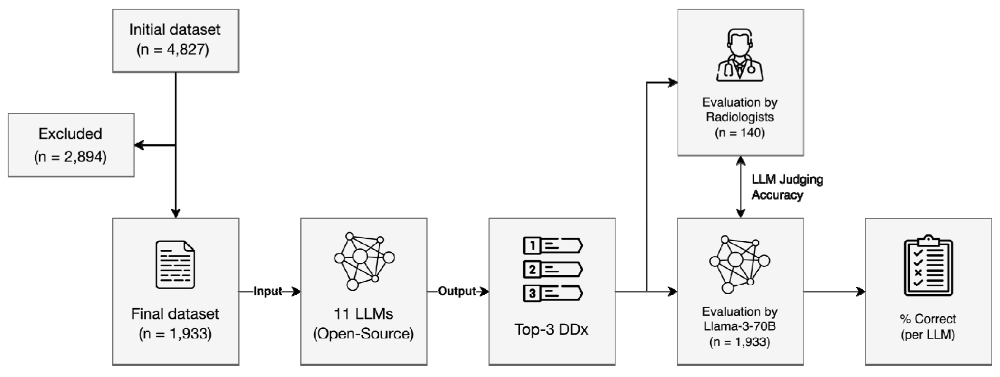
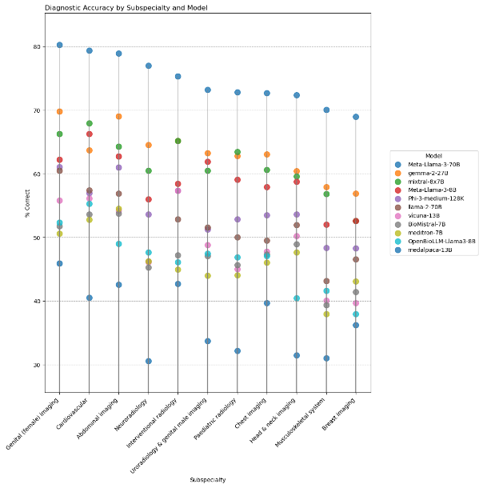

# Performance of Open-Source LLMs in Challenging Radiological Cases – A Benchmark Study on 1,933 Eurorad Case Reports

Recent advancements in large language models (LLMs) have created new ways to support radiological diagnostics. While both open-source and proprietary LLMs can address privacy concerns through local or cloud deployment, open-source models provide advantages in continuity of access, and potentially lower costs. In this study, we evaluated the diagnostic performance of eleven state-of-the-art open-source LLMs using clinical and imaging descriptions from 1,933 case reports in the Eurorad library. LLMs provided differential diagnoses based on clinical history and imaging findings. Responses were considered correct if the true diagnosis was included in the top three LLM suggestions.



Llama-3-70B evaluated LLM responses, with its accuracy validated against radiologist ratings in a case subset. Models were further tested on 60 non-public brain MRI cases from a tertiary hospital to assess generalizability. Llama-3-70B demonstrated superior performance, followed by Gemma-2-27B and Mixtral-8x-7B. Similar performance results were found in the non-public dataset, where Llama-3-70B, Gemma-2-27B, and Mixtral-8x-7B again emerged as the top models. Our findings highlight the potential of open-source LLMs as decision support tools for radiological differential diagnosis in challenging, real-world cases. 



## Files contained in this repo

To allow for the full reproducibility of our study, we publish detailed model links (below), EuroRad case IDs, and scripts to (i) generate LLM responses and (ii) have them evaluated by Llama-3-70B.
- eurorad_cases.csv: Full List of Case IDs selected to be included in our study. To review an individual case by its CaseID, go to https://eurorad.org/case/CaseID
- os_llm_benchmark.py: Script that performs the entire evaluation pipeline. In order to use this script, you need [llama_cpp_python](https://llama-cpp-python.readthedocs.io/en/latest/) installed in your python environment (we used v. 0.2.89). This script uses all models outlined below (so they need to be stored on your system) and has one example case, but it can be easily extended to more models and cases. Please see the comments in the script and FAQ below for some more information.

## LLMs used in our study

Please note that all models were quantized (gguf format) and used with [llama_cpp_python v. 0.2.89](https://github.com/abetlen/llama-cpp-python/releases/tag/v0.2.89)
|Model|# Params|Base Model|HF Link|Reference|
---|---|---|---|---
BioMistral-7B-DARE-GGUF-Q5_K_M.gguf | 7B | Mistral-7B | https://huggingface.co/BioMistral/BioMistral-7B-DARE-GGUF | https://arxiv.org/abs/2402.10373
Gemma-2-27b-it-Q5_K_M.gguf | 27B | Gemma-2 |https://huggingface.co/bartowski/gemma-2-27b-it-GGUF | https://arxiv.org/abs/2408.00118
Llama-2-70b-chat.Q4_K_M.gguf | 70B | Llama-2 | https://huggingface.co/TheBloke/Llama-2-70B-Chat-GGUF | https://arxiv.org/abs/2307.09288
Medalpaca-13b.Q5_K_M.gguf | 13B | LLaMA | https://huggingface.co/mradermacher/medalpaca-13b-GGUF | https://arxiv.org/abs/2304.08247
Meditron-7b-chat.Q5_K_M.gguf | 7B | Llama-2 | https://huggingface.co/TheBloke/meditron-7B-chat-GGUF | https://arxiv.org/abs/2311.16079
Meta-Llama-3-8B-Instruct-Q5_K_M.gguf | 8B | Llama-3 | https://huggingface.co/bartowski/Meta-Llama-3-8B-Instruct-GGUF | https://arxiv.org/abs/2407.21783
Meta-Llama-3-70B-Instruct-Q4_K_M.gguf | 70B | Llama-3 | https://huggingface.co/bartowski/Meta-Llama-3-70B-Instruct-GGUF | https://arxiv.org/abs/2407.21783
Mistral-Nemo-Instruct-2407-Q5_K_M.gguf | 12B | Mistral-Nemo | https://huggingface.co/bartowski/Mistral-Nemo-Instruct-2407-GGUF | https://mistral.ai/news/mistral-nemo/
Mistral-Small-Instruct-2409-Q5_K_M.gguf | 22B | Mistral-Small |https://huggingface.co/bartowski/Mistral-Small-Instruct-2409-GGUF | https://mistral.ai/news/september-24-release/
Mixtral-8x7b-instruct-v0.1.Q5_K_M.gguf | 8x7B MoE | Mistral-7B | https://huggingface.co/TheBloke/Mixtral-8x7B-Instruct-v0.1-GGUF | https://arxiv.org/abs/2401.04088
OpenBioLLM-Llama3-8B-Q5_K_M.gguf | 8B | Llama-3 | https://huggingface.co/bartowski/OpenBioLLM-Llama3-8B-GGUF | https://huggingface.co/blog/aaditya/openbiollm
OpenBioLLM-Llama3-70B.Q4_K_M.gguf | 70B | Llama-3 | https://huggingface.co/mradermacher/OpenBioLLM-Llama3-70B-GGUF | https://huggingface.co/blog/aaditya/openbiollm
Phi-3-medium-128k-instruct-Q5_K_M.gguf | 14B | Phi-3 | https://huggingface.co/bartowski/Phi-3-medium-128k-instruct-GGUF | https://arxiv.org/abs/2404.14219
Qwen2.5-32b-instruct-q5_k_m.gguf | 32B | Qwen-2.5 | https://huggingface.co/Qwen/Qwen2.5-32B-Instruct-GGUF | https://qwenlm.github.io/blog/qwen2.5/ & https://arxiv.org/abs/2407.10671
Vicuna-13b-v1.5.Q5_K_M.gguf | 13B | Llama-2 | https://huggingface.co/TheBloke/vicuna-13B-v1.5-GGUF | https://lmsys.org/blog/2023-03-30-vicuna/

## FAQ
*What GPU do I need?*  
As a rule of thumb, the model file size (.gguf) should be 1-2 GB smaller than your VRAM. Also, we currently fully offload models to the GPU's VRAM ("n_gpu_layers=-1" in the Llama() constructor call). If you change this to only partly offload to the GPU's memory, you can also load larger models / at higher quantization. However, this comes at a (relevant) speed penalty. 

*How to add models?*  
To add a new model, the easiest option is to (a) add it to the "MODEL_ZOO" section as a new dict entry (see examples there), and also identify or construct a new prompt format template in the "construct_prompt()" function. Note that llama_cpp_python also supports the "chat_format" argument as part of the Llama() constructor. However, we found that some older / custom models do not work well with this and rather require to explicitly program the prompt template (as our function does).

## Citation
```
@article {Kim2024.09.04.24313026,
	author = {Kim, Su Hwan and Schramm, Severin and Adams, Lisa C. and Braren, Rickmer and Bressem, Keno K. and Keicher, Matthias and Zimmer, Claus and Hedderich, Dennis M. and Wiestler, Benedikt},
	title = {Performance of Open-Source LLMs in Challenging Radiological Cases - A Benchmark Study on 1,933 Eurorad Case Reports},
	year = {2024},
	doi = {10.1101/2024.09.04.24313026},
	publisher = {Cold Spring Harbor Laboratory Press},
	URL = {https://www.medrxiv.org/content/early/2024/10/03/2024.09.04.24313026},
	journal = {medRxiv}
}
```
